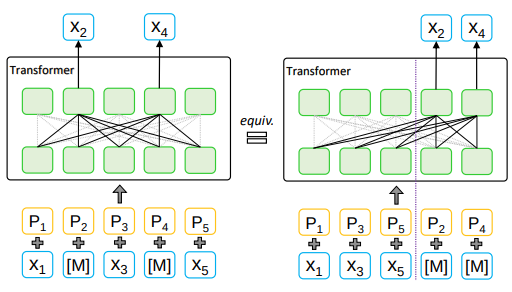
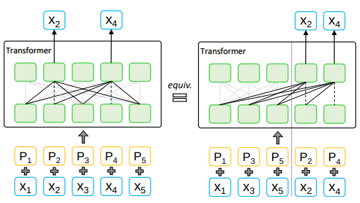
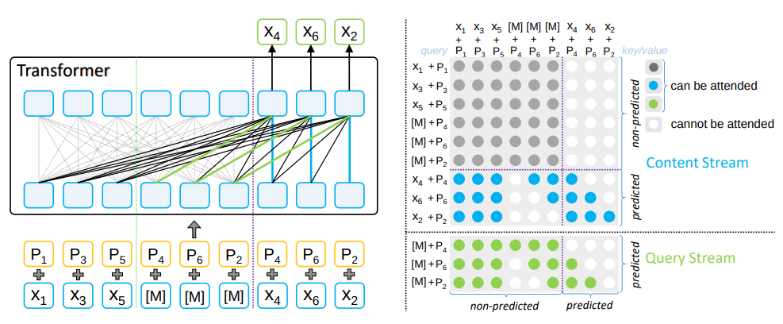
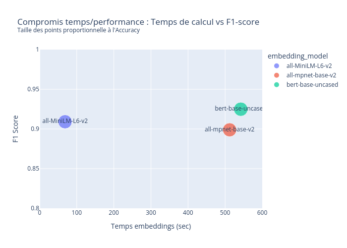
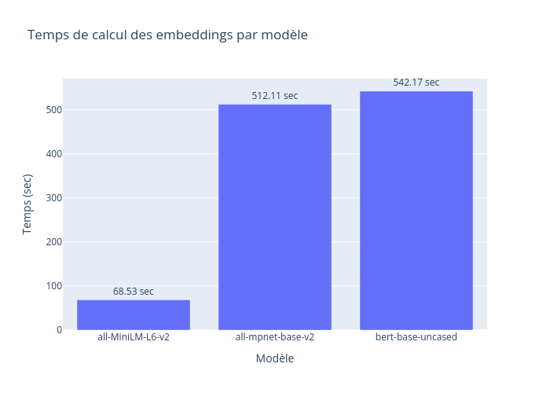
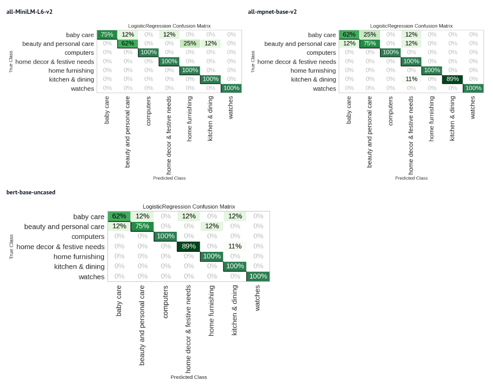
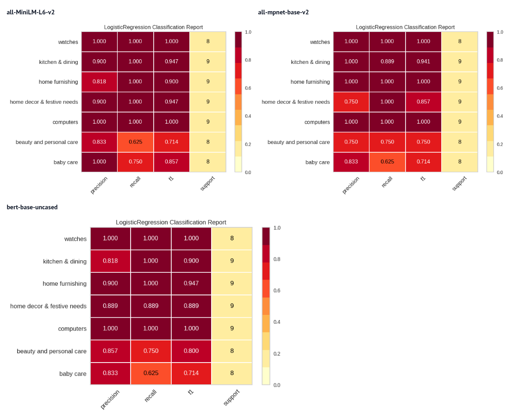

## État de l’art et benchmark des modèles d’embeddings pour la classification de descriptions de produits : une comparaison des Sentence Transformers récents (2020-2025)

### Introduction

Les modèles d’embeddings comme BERT, MPNet et MiniLM (@sbert_pretrained_models) ont révolutionné le traitement du texte ces 5 dernières années. Ils permettent de transformer des descriptions de produits en vecteurs numériques, utiles pour la classification automatique.

**Objectif** :

État de l’art : Analyser les performances des modèles récents (2020-2025) sur des tâches de NLP, en s’appuyant sur des sources comme arXiv, SBERT, et des benchmarks reconnus.

**Test pratique** : Comparer ces modèles sur un jeu de données réel de descriptions de produits (issu du projet @openclassrooms_projet6).

**Résultats** : Identifier quel modèle offre le meilleur compromis entre précision et rapidité pour une classification efficace.

Cette veille vise à fournir des recommandations claires pour choisir un modèle adapté à des applications concrètes, comme un système de catégorisation automatique.

@SUPRIYONO2024100173
@naveed2024comprehensiveoverviewlargelanguage

### Dataset retenu

Le dataset retenu provient du projet 6 "Classifier automatiquement des biens de consommations". Place de Marché, une entreprise anglophone souhaite automatiser l'attribution des catégories de produits sur sa place Marketplace, une tâche actuellement réalisée manuellement par les vendeurs. Le dataset se compose de 1 fichier CSV contenant la description de 1000 produits.

Les descriptions ont été prétraités suivant les bonnes pratiques de NLP (suppression des stopwords, mise en minuscule, lemmatisation , etcw).

### Modèles étudiés

Nous considérons trois modèles représentatifs :

- BERT
- Mpnet
- Mini-LM

---

### 1. BERT base uncased

**Références clés** :
BERT (Bidirectional Encoder Representations from Transformers) est l’un des premiers modèles à avoir popularisé les embeddings contextuels.

Il repose uniquement sur la partie encodeur de l’architecture Transformer, avec 12 couches et 768 dimensions.

L’entraînement combine deux tâches : le Masked Language Modeling (MLM), où certains tokens sont masqués et prédits à partir du contexte, et le Next Sentence Prediction (NSP), bien que ce dernier soit moins utilisé aujourd’hui.

::: {#fig-MLM}

Concept de fonctionnement de MLM
:::

**Forces** :

Modèle robuste, encore largement utilisé comme baseline dans les comparaisons.

Excellente capacité de contextualisation : le vecteur d’un mot varie selon son usage dans la phrase.

Large éventail d’applications : classification, question-réponse, reconnaissance d’entités nommées.

**Limites** :

Coût en calcul élevé : latence importante pour l’encodage, peu adapté aux environnements contraints.

---

### 2. MPNet (all-mpnet-base-v2)

**Rappel** : XLNet comme étape intermédiaire

Avant MPNet, XLNet (@yang2020xlnetgeneralizedautoregressivepretraining) avait été proposé pour surmonter une limite de BERT :

BERT prédit les tokens masqués indépendamment les uns des autres (Masked Language Modeling).

XLNet introduit le Permuted Language Modeling (PLM), où l’ordre des tokens est permuté et les prédictions s’effectuent de manière auto-régressive.

Cela permet de capturer les dépendances entre tokens prédits, ce que BERT ne faisait pas.

::: {#fig-PLM}

Concept de focntionnement de PLM
:::

**Limite de XLNet** : comme l’ordre des tokens est modifié, le modèle ne dispose pas toujours de la position exacte des mots dans leur séquence originale. Cela crée un décalage entre le pré-entraînement (phrases permutées) et l’utilisation réelle (phrases dans l’ordre normal).

**Principes de MPNet**

MPNet (Masked and Permuted Pre-training for Language Understanding) combine les avantages de BERT et XLNet :

Comme BERT, il conserve la visibilité complète du contexte grâce au masquage (Masked Language Modeling).

Comme XLNet, il introduit des dépendances entre tokens prédits, en les générant dans un ordre auto-régressif.

En plus, MPNet ajoute un mécanisme d’input consistency : le modèle connaît la position exacte de chaque token, même ceux masqués, ce qui corrige la limite de XLNet. (@song2020mpnetmaskedpermutedpretraining)

::: {#fig-MPNET}

Concept de fonctionnement de MPNET
:::

**Forces**

Excellente précision sur les tâches de similarité sémantique et de classification fine.

Combine le meilleur de BERT (vision contextuelle) et XLNet (dépendances entre prédictions).

Recommandé pour les applications où la qualité des représentations est critique (retrieval, recherche sémantique, Q&A).

**Limites**

Plus coûteux que les modèles distillés comme MiniLM.

Temps d’inférence et mémoire encore relativement élevés.

---

### 3. MiniLM / all-MiniLM-L6-v2

**Références clés** :

MiniLM (@wang2020minilm) repose sur la distillation de connaissances : un petit modèle (student) apprend à imiter les distributions d’attention d’un modèle plus grand (teacher).

La variante all-MiniLM-L6-v2 est entraînée spécifiquement pour les sentence embeddings, via un objectif contrastif sur de larges corpus.

**Forces** :

Rapidité et faible coût computationnel, adapté aux applications temps réel ou aux environnements contraints.Latence très réduite, tout en conservant une précision compétitive par rapport à des modèles plus lourds.Bon choix pour le multilingue et les systèmes embarqués.

**Limites** :

Légère perte de performance (5-8% en moyenne) par rapport à MPNet sur des tâches de similarité ou de classification fine.Moins adapté pour des textes longs ou des tâches nécessitant une compréhension très fine du contexte.

---

#### Méthodologie appliquée

#### 1. Données et préparation

Un échantillon de 1 000 descriptions produits a été extrait de la base nettoyée afin de limiter les coûts de calcul tout en gardant une représentativité des catégories.
Les données ont ensuite été divisées en **train/test (80/20)** de manière stratifiée pour préserver la distribution des classes.

---

#### 2. Encodage des textes

Les descriptions ont été transformées en vecteurs denses à l’aide de la librairie **Sentence Transformers (Hugging Face)**.
Trois modèles ont été comparés :

* **all-MiniLM-L6-v2** : léger, optimisé pour la rapidité,
* **all-mpnet-base-v2** : plus coûteux mais plus précis,
* **bert-base-uncased** : modèle historique, utilisé comme baseline.

Chaque encodage a été chronométré et sauvegardé afin d’assurer la reproductibilité des expériences.

---

#### 3. Modélisation supervisée

Pour évaluer la qualité des embeddings, un modèle de **régression logistique** a été retenu comme classifieur de référence.
Ce choix se justifie par :

* sa simplicité d’entraînement,
* sa rapidité d’exécution,
* sa pertinence comme baseline pour comparer différentes représentations.

L’entraînement et l’évaluation ont été réalisés avec **PyCaret**, incluant une validation croisée afin de limiter le sur-apprentissage.

---

#### 4. Évaluation et comparaison

Les performances ont été mesurées à l’aide des principales métriques de classification (**F1-score, précision, rappel, accuracy**).
En parallèle, le **temps d’encodage** et le **temps de prédiction** ont été suivis afin d’intégrer une dimension d’efficacité computationnelle.

Les résultats de chaque combinaison *embedding + classifieur* ont ensuite été centralisés pour comparaison.

::: {.callout-note}
## *Pour rappel*

**Accuracy (Exactitude)** :
Mesure le pourcentage total de description correctement classifiées par le modèle parmi toutes les images de l’ensemble de test. Elle donne une vue d’ensemble de la performance globale du modèle.

**Précision (Precision)** :
Mesure la proportion d’éléments correctement identifiés comme appartenant à une classe spécifique parmi tous ceux que le modèle a prédits comme appartenant à cette classe. Elle permet d’évaluer la capacité du modèle à éviter les faux positifs.

**Rappel (Recall)** :
Mesure la proportion d’éléments appartenant réellement à une classe spécifique qui sont correctement identifiés par le modèle. Elle évalue la capacité du modèle à détecter tous les éléments pertinents pour une classe donnée.

**F1-score** :
Représente la moyenne harmonique de la précision et du rappel. Il offre une mesure équilibrée de la performance du modèle, en tenant compte à la fois des faux positifs et des faux négatifs.

**Matrice de confusion** :
Tableau qui détaille le nombre de prédictions correctes et incorrectes pour chaque classe. Elle permet de visualiser les erreurs du modèle et d’identifier les classes qui posent problème.

:::
---

### 4. Comparaison synthétique

Comparaison des modèles sur les données de test.

::: {#fig-embeddings-comparaison layout-ncol=2}

{#fig-scatter-plot}

{#fig-bar-plot}

Analyse des méthodes d'embeddings
:::

::: {#fig-comparaison-confusion-matrix}

Confusion matrix en fonction de la méthode d'embedding utilisée.
:::

::: {#fig-comparaison-class-report}

Confusion matrix en fonction de la méthode d'embedding utilisée.
:::

Les résultats de cette étude comparative montrent des différences significatives entre les modèles d’embeddings testés, tant en performance qu’en efficacité computationnelle. Parmi les trois modèles évalués, **all-MiniLM-L6-v2** apparaît comme le meilleur compromis. 

Il combine une performance stable sur l’ensemble des catégories (macro F1-score 0.89, micro F1-score 0.91) avec un temps de calcul réduit (~100 secondes pour le dataset testé). Ce modèle maintient particulièrement bien ses performances sur les catégories sous-représentées, ce qui se reflète dans son macro F1-score supérieur aux autres modèles.

En comparaison, bert-base-uncased atteint un micro F1-score légèrement supérieur (0.92), mais son coût computationnel est jusqu’à cinq fois plus élevé, sans gain significatif sur les catégories critiques telles que baby care ou beauty & personal care. Quant à all-mpnet-base-v2, il affiche une performance moyenne solide (macro F1-score 0.87) et se distingue sur certaines catégories spécifiques, comme home decor & festive needs, où il obtient un F1-score parfait.

Ces résultats suggèrent que all-MiniLM-L6-v2 est le choix optimal pour un équilibre entre rapidité et précision, tandis que bert-base-uncased pourrait être envisagé lorsque la performance prime sur les contraintes de temps, bien que le gain marginal ne justifie pas toujours le surcoût computationnel.

### 5. Limites et améliorations possibles

La méthodologie présentée comporte plusieurs limites :

* **Taille du jeu de données** : l’échantillon utilisé (1 000 descriptions) permet de réduire les temps de calcul, mais il reste restreint. Les résultats obtenus ne sont donc pas nécessairement généralisables à un corpus de plus grande ampleur.
* **Modèle de classification simple** : l’utilisation d’une régression logistique constitue un bon point de départ pour comparer des embeddings, mais elle ne reflète pas le potentiel maximal des représentations, qui pourraient mieux s’exprimer avec des modèles plus complexes (p. ex. réseaux de neurones légers ou gradient boosting).
* **Diversité des données** : les descriptions analysées appartiennent à un domaine particulier (produits). Les performances des modèles pourraient varier sur d’autres types de textes (avis clients, articles techniques, etc.).

### Pistes d’amélioration

* Étendre l’expérimentation à un corpus plus large afin de vérifier la robustesse des résultats.
* Évaluer d’autres classifieurs supervisés (Random Forest, XGBoost, MLP) pour tester la sensibilité des embeddings aux choix de modèles.
* Explorer des approches multilingues ou spécialisées par domaine (ex. modèles d’embeddings entraînés sur du texte produit/retail).

---

**En conclusion** : 

- **Pour une application nécessitant rapidité et légèreté** : all-MiniLM-L6-v2 est le meilleur choix pour des utilisation limitées en puissance de calcul.

- **Pour une application critique en précision** : all-mpnet-base-v2 est recommandé, avec des benchmarks solides en retrieval et classification.

- **Pour du fine-tuning sur un domaine spécifique** : BERT base uncased reste une référence, avec une abondance de travaux récents confirmant sa robustesse après adaptation.
